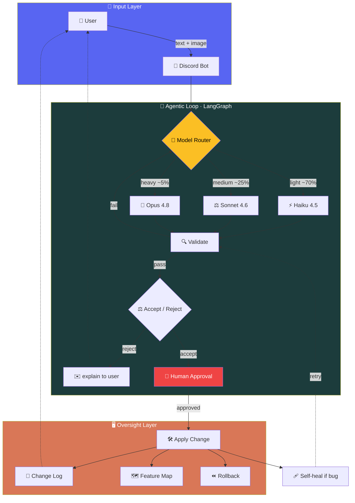
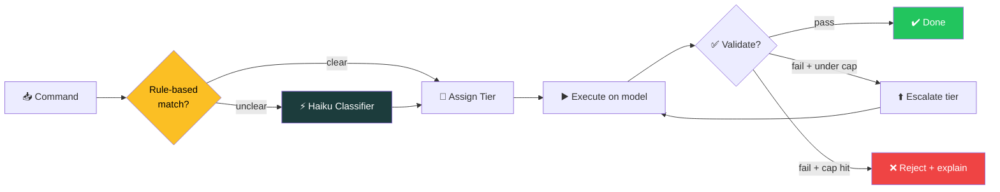

<div align="center">

# 🧬 Adaptive Web Platform

### เว็บแอปที่แก้ไขตัวเองตามภาษาธรรมชาติจากผู้ใช้

*A self-evolving web application driven by natural language — users speak, the system reshapes itself.*

<br>


<br>


<br>

`natural-language` · `agentic-ai` · `self-modifying` · `langgraph` · `multimodal` · `cost-optimized`

</div>

---

> [!NOTE]
> **Status:** Future Plan / Concept · **Last updated:** 2026-06-24
> เอกสารนี้เป็น design document สำหรับเก็บไว้เป็นแผนในอนาคต ยังไม่ใช่ implementation

---

## 📑 Table of Contents

- [✨ Overview](#-overview)
- [🏗️ Architecture](#️-architecture)
- [🧩 Core Components](#-core-components)
  - [Input Layer](#1️⃣-input-layer--ช่องทางรับ-message)
  - [Oversight Layer (Admin)](#2️⃣-oversight-layer--admin-site)
  - [Agentic Loop](#3️⃣-agentic-loop--self-validation)
  - [Workflow Engine](#4️⃣-autonomous-workflow-engine)
- [🎯 Design Principles](#-design-principles)
- [⚙️ Method — Scalability, Token Efficiency, Cost](#️-method--scalability-token-efficiency--cost-optimization)
  - [Token Efficiency](#-token-efficiency)
  - [Cost Optimization](#-cost-optimization)
  - [Scalability](#-scalability)
  - [Estimated Token Usage](#-estimated-token-usage)
  - [Recommended Framework](#-recommended-framework--langgraph)
  - [Model Router](#-model-router)
- [💰 Cost Analysis](#-cost-analysis)
- [✅ Roadmap / TODO](#-roadmap--todo)
- [⚠️ Notes & Risks](#️-notes--risks)

---

## ✨ Overview

Web application ที่ผู้ใช้สามารถ **"สั่ง"** เปลี่ยนแปลงระบบได้ด้วยภาษาธรรมชาติ (natural language) โดยมี LLM เป็นแกนกลางที่แปลคำสั่งเป็นการแก้ไขจริง — ทั้ง **UI**, **feature**, และ **workflow** — แบบ dynamic

แนวคิดหลัก:

> 🔑 LLM มีอิสระในการตัดสินใจและดำเนินการเอง แต่ทุกการเปลี่ยนแปลง **มองเห็นได้ (visible)** และ **ย้อนกลับได้ (reversible)** ผ่านระบบ admin ที่กำกับดูแลและตรวจสอบได้เสมอ

---

## 🏗️ Architecture



---

## 🧩 Core Components

### 1️⃣ Input Layer — ช่องทางรับ Message

รับคำสั่งจากผู้ใช้ผ่านช่องทางที่ไม่มีค่าใช้จ่าย รองรับทั้ง **ข้อความ (natural language)** และ **ภาพ (image)**

| ตัวเลือก | รายละเอียด | ข้อดี |
|---------|-----------|-------|
| **🟢 Discord Bot** *(primary)* | ฟรี, API เปิด, รองรับ attachment (รูปภาพ) ในตัว, มี thread/channel แยกบริบทได้ | community-based, รับทั้ง text + image, จัดการ multi-user ง่าย |
| **In-app command bar** | chat input ในตัวเว็บแอป | ไม่พึ่ง third-party, จัดการ context/auth ง่าย |
| **Telegram Bot** | ทางเลือกแทน Discord | rate ผ่อนปรน |

> [!TIP]
> **Decision:** เริ่มที่ **Discord Bot** เป็น primary channel → เพิ่ม in-app command bar เป็น optional ภายหลัง

<details>
<summary><b>🖼️ Image Input Support</b></summary>

<br>

ผู้ใช้สามารถส่งภาพประกอบคำสั่งได้ (multimodal input) เช่น:

- 📐 แนบ **screenshot / mockup** ของ UI ที่ต้องการ → ระบบแปลภาพเป็นการเปลี่ยนแปลง layout/component
- 🗂️ แนบ **diagram / flowchart** ที่วาดมือ → ระบบตีความเป็น workflow
- 🐞 แนบ **ภาพ error / bug** ที่เจอ → ระบบใช้ประกอบการ diagnose

**กลไก:** ภาพถูกส่งผ่าน Discord attachment → ผ่าน vision-capable LLM (image-to-instruction) → รวมกับ text command ใน context เดียวกันก่อนตัดสินใจ accept/reject

> ⚠️ vision model มีต้นทุนสูงกว่า text-only — ต้องชั่งน้ำหนักกับข้อจำกัด API cost (ดู [Roadmap](#-roadmap--todo))

</details>

### 2️⃣ Oversight Layer — Admin Site

หน้าจัดการแยกต่างหาก (web-based dashboard) ทำหน้าที่กำกับและตรวจสอบ

| Feature | หน้าที่ |
|---------|--------|
| 📜 **Change Log / Audit** | สรุปว่าโมเดลแก้อะไรไปบ้าง: diff, timestamp, คำสั่งต้นทาง, เหตุผลที่ LLM ตัดสินใจ |
| 🗺️ **Feature Map** | รายการ feature + dependency graph (feature A เรียก B → แก้ A อาจกระทบ C) |
| 🔍 **Diff Viewer** | เปรียบเทียบ before/after ก่อน deploy จริง |
| ⏪ **Rollback** | ย้อนกลับเวอร์ชันได้หากการแก้ไขผิดพลาด |

### 3️⃣ Agentic Loop — Self-Validation

ระบบตรวจสอบและตัดสินใจเองก่อนนำคำสั่งไปใช้

- 🐞 **หาบัคเอง** — รัน validation/test กับโค้ดหรือ config ที่ generate ออกมา ตรวจ syntax, type, logic conflict ก่อน apply
- ⚖️ **Accept / Reject User Request** — ประเมินคำสั่ง:
  - ✅ ปลอดภัยและทำได้ → **accept** และดำเนินการ
  - ❌ ขัดแย้งกับ feature เดิม / เสี่ยงพังระบบ / เกินสิทธิ์ → **reject** พร้อมอธิบายเหตุผลกลับไปหาผู้ใช้
- 🩹 **Self-Healing** — หากพบบัคหลัง apply พยายามแก้เองและ validate ซ้ำในลูป

### 4️⃣ Autonomous Workflow Engine

เว็บแอปสามารถสร้างและรัน workflow ได้เอง

- ผู้ใช้อธิบายขั้นตอนที่ต้องการเป็นภาษาธรรมชาติ → ระบบแปลเป็น workflow (ลำดับขั้น, เงื่อนไข, trigger)
- รองรับ **multi-step automation** ที่ทำงานต่อเนื่องโดยไม่ต้องสั่งทีละขั้น
- workflow ที่สร้างถูกบันทึกใน feature map และตรวจสอบได้ผ่าน admin

---

## 🎯 Design Principles

| # | Principle | ความหมาย |
|---|-----------|---------|
| 1 | **Visible & Reversible** | ทุกการเปลี่ยนแปลงต้องมองเห็นได้และย้อนกลับได้ |
| 2 | **Guardrailed Autonomy** | LLM มีอิสระในการตัดสินใจ แต่อยู่ภายใต้ guardrail ของ admin |
| 3 | **Transparency** | accept/reject และ self-validation อัตโนมัติ แต่ผลลัพธ์ทั้งหมดถูกบันทึก |

---

## ⚙️ Method — Scalability, Token Efficiency & Cost Optimization

หลักการออกแบบเชิงวิศวกรรมเพื่อให้ระบบ scale ได้และคุม cost ภายใต้ข้อจำกัด API budget

### 🔹 Token Efficiency

| เทคนิค | รายละเอียด | ผลที่ได้ |
|--------|-----------|---------|
| **Prompt caching** | cache system prompt + feature map ที่ stable (Anthropic ~10% ของ input rate; OpenAI/Gemini ลดได้ถึง 90%) | input cost ↓ 70–90% บนส่วนซ้ำ |
| **Structured output (JSON)** | บังคับ output เป็น JSON + ตั้ง `max_tokens` แทน prose ยาว | output cost ↓ (output แพงกว่า input 3–10×) |
| **Context compression / RAG** | ดึงเฉพาะส่วนที่เกี่ยวข้องผ่าน retrieval แทนส่ง feature map/codebase ทั้งก้อน | input token ↓ มหาศาลเมื่อระบบโต |
| **Lazy image processing** | เรียก vision model เฉพาะเมื่อมี attachment | ตัด vision cost ออกจาก text-only request |
| **Summarize history** | สรุป conversation history เก่าแทนส่งดิบ | กัน context โตแบบ linear |

### 🔹 Cost Optimization

- 🧭 **Model routing (สำคัญที่สุด)** — แยกงานตามความยาก: คำสั่งง่าย → cheap model; งานยาก → frontier model เท่านั้น (ลด cost 10×+)
- 📦 **Batch API** — งานที่ไม่ต้อง real-time (สรุป change log, วิเคราะห์ dependency แบบ async) → batch ลด 50%
- 🔧 **Cheap validation** — ใช้ rule-based / linter / type-checker ก่อนเรียก LLM diagnose
- 🚨 **Spending alerts** — ตั้ง budget alert + track cost per command

### 🔹 Scalability

- 💾 **Stateful checkpointing** — เก็บ state แต่ละขั้นของ agent เพื่อ resume/retry ได้ (LangGraph มี PostgresSaver ในตัว)
- 🔀 **Per-channel context isolation** — แยก context ตาม Discord channel/thread
- ⏳ **Queue + worker** — คำสั่งเข้า queue แล้วประมวลผลด้วย worker pool กัน rate limit ชน
- 🎛️ **Config-driven over code-gen** — apply ผ่าน config/feature-flag schema แทน generate โค้ดดิบ → ตรวจสอบและ rollback ง่าย

### 🔹 Estimated Token Usage

ประมาณการต่อ **1 คำสั่ง** (รวม agentic loop หลายรอบ) — เป็นสมมติฐาน ควร log จริงใน pilot

| สถานการณ์ | Input | Output | หมายเหตุ |
|-----------|-------|--------|---------|
| 🟢 ง่าย (text, 1–2 loop) | 8K–15K | 1K–3K | system prompt + feature map ย่อ + คำสั่ง |
| 🟡 กลาง (text, validate + retry) | 15K–30K | 3K–8K | มี self-validation loop |
| 🔴 ซับซ้อน (text, multi-step) | 30K–60K+ | 8K–20K | วน loop หลายรอบ + diagnose บัค |
| ➕ Image input | +1.5K–3K / ภาพ | — | vision model |

### 🔹 Recommended Framework — LangGraph

> [!IMPORTANT]
> **แนะนำหลัก: LangGraph** — production standard สำหรับ stateful, auditable agentic workflow

เหตุผลที่ตรงกับโปรเจกต์นี้:

- ✅ stateful + auditable + human approval — ตรงกับ admin oversight + accept/reject + rollback เป๊ะ
- ✅ **directed graph + typed state** — ควบคุมลำดับ (validate → decide → apply → self-heal) inspect/test ง่าย
- ✅ **built-in checkpointing** (resume / retry / time-travel debugging) — สำคัญมากต่อ self-validation loop และ rollback
- ✅ **human-in-the-loop ผ่าน interrupt** — แทรกจุดให้ admin อนุมัติก่อน apply ได้ตรงๆ
- ✅ **provider-agnostic** — สลับ model ได้ตาม routing ไม่ผูก provider เดียว
- ✅ รองรับ **MCP** natively

<details>
<summary><b>ทางเลือกอื่น (CrewAI / OpenAI Agents SDK / Claude Agent SDK)</b></summary>

<br>

| Framework | จุดเด่น | เหมาะเมื่อ |
|-----------|--------|-----------|
| **CrewAI** | path เร็วที่สุดสู่ multi-agent prototype (role-based) | ต้องการ prototype เร็ว แต่หลายทีม "outgrow" ตอน scale |
| **OpenAI Agents SDK** | low-overhead, handoff pattern, integration แน่นกับ GPT | deploy แบบ OpenAI-native แต่ผูก provider เดียว |
| **Claude Agent SDK** | architecture เดียวกับ Claude Code, hooks/MCP/skills/subagents | สร้าง Claude-native agent ที่อยากได้ Memory + native tool use |

> framework ที่ห่อรอบ model มีผลต่อ performance ได้มาก (รายงานต่างกันได้ถึง ~30 percentage points บน model เดียวกัน) — orchestration ไม่ใช่เรื่องรอง

</details>

### 🔹 Model Router

หัวใจของ cost optimization — แทนที่จะส่งทุกคำสั่งไป model ตัวเดียว ให้ **router** จัดประเภทคำสั่งก่อน แล้วส่งไป model ที่ถูกที่สุดที่ยังทำงานได้ดีพอ

> 💡 Haiku ถูกกว่า Sonnet **5×** และถูกกว่า Opus **25×** — งานง่ายไป tier ล่างลด cost ได้มากที่สุดโดยไม่เสียคุณภาพ

#### Routing Tiers

| Tier | Model | ใช้กับคำสั่งแบบ | สัดส่วน |
|------|-------|----------------|--------|
| ⚡ **Light** | `Haiku 4.5` · $1/$5 | rename, แก้สี/ข้อความ, toggle flag, query feature map, classify intent | ~70% |
| ⚖️ **Medium** | `Sonnet 4.6` · $3/$15 | แก้ component, เพิ่ม field, validate + retry, diagnose บัคทั่วไป | ~25% |
| 🧠 **Heavy** | `Opus 4.8` · $5/$25 | refactor หลายไฟล์, ออกแบบ workflow ใหม่, แก้บัคที่กระทบ dependency ซับซ้อน | ~5% |

> สัดส่วน **70/25/5** แทน Sonnet ล้วน → ลด cost รวมได้มากกว่าครึ่งบน workload ทั่วไป

#### How the Router Decides

จัดประเภทจาก **ความซับซ้อนของคำสั่ง** ก่อนเข้า main loop — เรียงตามต้นทุน:

1. **Rule-based** *(ถูกสุด, เริ่มที่นี่)* — แมตช์ keyword/pattern: `เปลี่ยนสี/rename/ซ่อน` → Light; `refactor/redesign` → Heavy. deterministic ไม่กิน token แต่ครอบคลุมจำกัด
2. **Haiku classifier** — ส่งให้ Haiku จัดประเภทก่อน (token น้อยมาก เพราะ Haiku ถูก + output แค่ tier label) → ยืดหยุ่นกว่า
3. **Hybrid** *(แนะนำ)* — rule-based จับเคสชัด → เคสไม่ชัด fallback ไป Haiku classifier

#### Escalation & Fallback

- ⬆️ **Escalation** — ถ้า Light model validate ไม่ผ่าน → escalate ขึ้น tier ถัดไปอัตโนมัติ แทน reject ทันที
- 🔁 **Fallback** — ถ้า model error/timeout → ลอง tier ที่เสถียรกว่า
- 🖼️ **Image override** — คำสั่งที่มี image ต้อง route ไป vision model (Sonnet/Opus) ข้าม Haiku เสมอ
- 🛑 **Escalation cap** — จำกัดจำนวนครั้ง escalate ต่อคำสั่ง กัน loop วนขึ้น Opus จน cost พุ่ง

#### Router Flow



#### Integration กับ LangGraph

router เป็น **node แรก** ใน graph ก่อน main loop — เพราะ LangGraph เป็น provider-agnostic การสลับ model ต่อ node ทำได้ตรงๆ router แค่ set ว่า node ถัดไปใช้ model ตัวไหนตาม tier ที่ตัดสิน

---

## 💰 Cost Analysis

> ราคา **Claude API** (มิ.ย. 2026): `Opus 4.8` $5/$25 · `Sonnet 4.6` $3/$15 · `Haiku 4.5` $1/$5 ต่อ 1M token · prompt caching ลด cached input 90% · batch ลด 50%

### 🧍 Personal Use Scenario

สำหรับใช้ส่วนตัวคนเดียว volume ต่ำ (~10–30 คำสั่ง/วัน) สมมติ 20K input + 5K output/คำสั่ง, เดือน = ~22 วันใช้งานจริง:

| Volume | Sonnet ตรงๆ | Sonnet + cache | 🏆 Routing + cache |
|--------|-------------|----------------|-------------------|
| 🟢 เบา (~10/วัน) | ~$30/เดือน | ~$21/เดือน | **~$12/เดือน** |
| 🟡 กลาง (~20/วัน) | ~$59/เดือน | ~$43/เดือน | **~$24/เดือน** |
| 🔴 หนัก (~30/วัน) | ~$89/เดือน | ~$64/เดือน | **~$36/เดือน** |

> [!TIP]
> **ข้อสังเกตสำหรับ personal use:**
> - ถูกกว่าที่คิดเยอะ — volume ต่ำทำให้ cost อยู่หลักสิบดอลลาร์/เดือน ไม่ใช่หลักพันแบบ production
> - **caching อาจไม่คุ้ม TTL** — ถ้าสั่งห่างเกิน 5 นาที cache หมดอายุก่อนใช้ซ้ำ (cache write 1.25× สำหรับ TTL 5 นาที, 2.0× สำหรับ 1 ชม.) → caching ช่วยเฉพาะตอนสั่งรัวติดกัน
> - **เริ่มแบบไม่ต้อง optimize ก่อนได้** — เริ่มด้วย Sonnet 4.6 ตัวเดียว (~$40–60/เดือน) แล้วค่อยเพิ่ม routing ทีหลัง
> - **image input** บวก ~$2–5/เดือน (vision คิดเป็น token ปกติ ไม่ใช่ค่าแยก)

### 🏢 Production Reference (เปรียบเทียบ)

สมมติ 500 คำสั่ง/วัน, เฉลี่ย 20K input + 5K output, Sonnet ตรงๆ:

```
Input:  500 × 20K × ($3 / 1M)  = $30/วัน
Output: 500 × 5K  × ($15 / 1M) = $37.5/วัน
รวม ≈ $67.5/วัน → ~$2,025/เดือน (ก่อน optimize)
```

**หลัง optimize** (caching + routing 70% ไป cheap model + batch async) → ลด **60–80%** → เหลือ **~$400–800/เดือน**

> ตัวเลขทั้งหมดเป็น estimate จากสมมติฐาน — ตัวจริงต้อง log `usage` จาก API response แล้วดูค่าเฉลี่ยจริง และราคา API ปี 2026 เปลี่ยนเร็ว ควรเช็คล่าสุดตอน implement

---

## ✅ Roadmap / TODO

- [ ] เลือก mechanism apply การเปลี่ยนแปลง: code-gen vs. **config-driven** (schema/feature flags) — config-driven ปลอดภัย rollback ง่ายกว่า
- [ ] ออกแบบ **sandbox / staging** สำหรับ validate ก่อน apply เข้า production
- [ ] กำหนด **permission model** (RBAC) — ใครสั่งอะไรได้บ้าง
- [ ] เลือก LLM ภายใต้ข้อจำกัด API cost
- [ ] เลือก **vision model** สำหรับ image input — เรียกเฉพาะเมื่อมี attachment เพื่อลด cost
- [ ] เลือก **model router strategy**: rule-based / Haiku classifier / hybrid (เริ่ม rule-based ก่อน)
- [ ] กำหนด **escalation cap** ต่อคำสั่ง กัน loop วนขึ้น Opus จน cost พุ่ง
- [ ] ออกแบบ **schema ของ Feature Map** + dependency graph
- [ ] กำหนด **rollback granularity** (ย้อนทีละ change หรือทีละ snapshot)
- [ ] ตั้ง **observability / tracing** (LangSmith / Langfuse) เพื่อ track token + cost per command
- [ ] ทำ **pilot** เพื่อ log token จริง แล้ว extrapolate งบ (buffer 1.7–2×)

---

## ⚠️ Notes & Risks

> [!WARNING]
> แนวคิดนี้ใกล้เคียงกับ **self-modifying / agentic system** — จุดเสี่ยงหลักคือการให้ LLM แก้ระบบ production โดยตรง

หัวใจที่ทำให้ปลอดภัยพอจะใช้งานจริง:

```
staging + diff approval + rollback
```

ทั้งสามอย่างนี้คือ guardrail ที่ขาดไม่ได้ — ปล่อยให้ LLM autonomous ได้ แต่ต้องมีจุดให้มนุษย์ตรวจและย้อนกลับเสมอ

<br>

<div align="center">

---

*Made as a future-plan design doc · ปรับแก้ได้ตามต้องการ*

</div>
